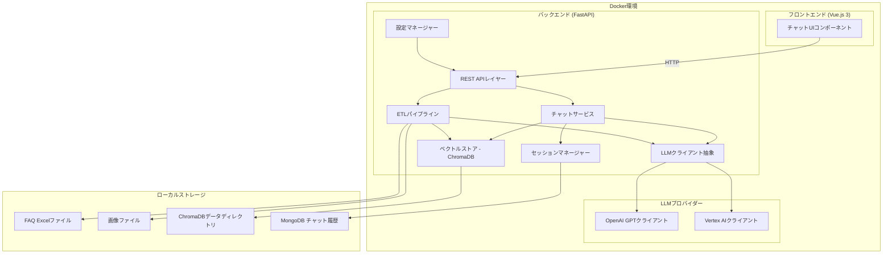

# デザインドキュメント: FAQチャットボット

## 概要

FAQチャットボットは、ExcelファイルのFAQデータと画像をベクトル化し、RAGパターンでユーザーの質問に回答するシステムである。バックエンドはPython 3.14/FastAPI、フロントエンドはVue.js 3、ベクトルストアはChromaDB（ファイルベース）を使用する。チャット履歴の保存にはMongoDB（ドキュメントDB）を使用し、Docker ComposeでMongoDBコンテナをローカルに起動する。LLMクライアントは抽象化され、OpenAI GPTとVertex AIを切り替え可能にする。Docker Composeでローカル環境を構築し、DeepEvalで回答精度を評価する。

## アーキテクチャ



### 技術スタック

| レイヤー | 技術 | 理由 |
|---------|------|------|
| バックエンド | Python 3.14 + FastAPI | 非同期対応、型ヒント、自動ドキュメント生成 |
| フロントエンド | Vue.js 3 + Vite | 軽量、Composition API、高速ビルド |
| ベクトルストア | ChromaDB | ファイルベース、サーバー不要、Python native |
| チャット履歴DB | MongoDB + motor | ドキュメントDB、Docker Composeでローカル起動、スケーラブル |
| Excel解析 | openpyxl | .xlsx形式の標準ライブラリ |
| LLM（ローカル） | OpenAI API (gpt-4o) | チーム全員がアクセス可能 |
| LLM（本番） | Vertex AI | GCPネイティブ |
| Embedding | OpenAI text-embedding-3-small | コスト効率、十分な精度 |
| 精度評価 | DeepEval | RAG評価に特化したフレームワーク |
| コンテナ | Docker Compose | ローカル環境の統一 |

## コンポーネントとインターフェース

### 1. ETLパイプライン (`backend/etl/`)

Excel FAQデータと画像を読み込み、ベクトル化してChromaDBに保存する。

```python
# backend/etl/pipeline.py
class ETLPipeline:
    def __init__(self, config: AppConfig, llm_client: LLMClientBase, vector_store: VectorStore):
        ...

    async def ingest_all(self) -> IngestResult:
        """Excelファイルと画像を一括取り込み"""
        ...

    async def ingest_excel(self, file_path: Path) -> IngestResult:
        """単一Excelファイルの取り込み"""
        ...

    async def ingest_images(self, directory: Path) -> IngestResult:
        """画像ディレクトリの取り込み"""
        ...
```

```python
# backend/etl/excel_reader.py
class ExcelReader:
    def read_faq_excel(self, file_path: Path) -> list[FAQEntry]:
        """Excelファイルを読み込み、公開ステータスの行をFAQEntryリストとして返す"""
        ...

    def faq_entry_to_chunk(self, entry: FAQEntry) -> Chunk:
        """FAQEntryをChunkに変換（タイトル+本文結合）"""
        ...
```

```python
# backend/etl/image_processor.py
class ImageProcessor:
    def __init__(self, llm_client: LLMClientBase):
        ...

    async def process_image(self, image_path: Path) -> ImageDocument:
        """画像からマルチモーダルAPIで説明テキストを生成し、ImageDocumentを返す"""
        ...
```

### 2. ベクトルストア (`backend/store/`)

ChromaDBをラップし、Chunk/ImageDocumentの保存と類似度検索を提供する。

```python
# backend/store/vector_store.py
class VectorStore:
    def __init__(self, config: AppConfig):
        ...

    async def add_chunks(self, chunks: list[Chunk], embeddings: list[list[float]]) -> None:
        """Chunkとそのembeddingをストアに追加"""
        ...

    async def add_image_documents(self, docs: list[ImageDocument], embeddings: list[list[float]]) -> None:
        """ImageDocumentとそのembeddingをストアに追加"""
        ...

    async def search(self, query_embedding: list[float], top_k: int = 3) -> list[SearchResult]:
        """コサイン類似度で上位k件を検索"""
        ...

    def is_empty(self) -> bool:
        """ストアにデータが存在するか確認"""
        ...
```

### 3. LLMクライアント (`backend/llm/`)

OpenAIとVertex AIを切り替え可能な抽象クライアント。

```python
# backend/llm/base.py
from abc import ABC, abstractmethod

class LLMClientBase(ABC):
    @abstractmethod
    async def chat_completion(self, messages: list[dict]) -> LLMResponse:
        """チャット補完を実行"""
        ...

    @abstractmethod
    async def generate_embedding(self, text: str) -> list[float]:
        """テキストのembeddingを生成"""
        ...

    @abstractmethod
    async def generate_embeddings(self, texts: list[str]) -> list[list[float]]:
        """複数テキストのembeddingを一括生成"""
        ...

    @abstractmethod
    async def describe_image(self, image_path: Path) -> str:
        """画像の説明テキストを生成"""
        ...
```

```python
# backend/llm/openai_client.py
class OpenAIClient(LLMClientBase):
    """OpenAI API実装"""
    ...

# backend/llm/vertexai_client.py
class VertexAIClient(LLMClientBase):
    """Vertex AI実装（将来用スタブ）"""
    ...

# backend/llm/factory.py
def create_llm_client(config: AppConfig) -> LLMClientBase:
    """設定に基づいてLLMクライアントを生成"""
    ...
```

### 4. チャットサービス (`backend/services/`)

RAGパイプラインのオーケストレーション。

```python
# backend/services/chat_service.py
class ChatService:
    def __init__(self, llm_client: LLMClientBase, vector_store: VectorStore, session_manager: SessionManager, config: AppConfig):
        ...

    async def answer(self, question: str, session_id: str) -> ChatResponse:
        """質問に対してRAGパターンで回答を生成"""
        ...

    def _build_prompt(self, question: str, context: list[SearchResult], history: list[ChatMessage]) -> list[dict]:
        """システムプロンプト、コンテキスト、履歴、質問を組み合わせたプロンプトを構築"""
        ...
```

### 5. セッションマネージャー (`backend/services/`)

MongoDBを使用したチャット履歴のセッション管理。

```python
# backend/services/session_manager.py
from motor.motor_asyncio import AsyncIOMotorClient

class SessionManager:
    def __init__(self, config: AppConfig):
        self.client = AsyncIOMotorClient(config.mongodb_uri)
        self.db = self.client[config.mongodb_db_name]
        self.sessions = self.db["sessions"]
        ...

    async def create_session(self) -> str:
        """新しいセッションIDを発行し、MongoDBにセッションドキュメントを作成"""
        ...

    async def add_message(self, session_id: str, question: str, answer: str, sources: list[SourceInfo]) -> None:
        """質問と回答をセッションのメッセージ配列に追加"""
        ...

    async def get_recent_history(self, session_id: str, n: int = 5) -> list[ChatMessage]:
        """直近N件の履歴を取得"""
        ...
```

### 6. REST API (`backend/api/`)

FastAPIルーター。

```python
# backend/api/routes.py
router = APIRouter(prefix="/api")

@router.post("/chat")
async def chat(request: ChatRequest) -> ChatResponse: ...

@router.post("/ingest")
async def ingest() -> IngestResponse: ...

@router.get("/health")
async def health() -> HealthResponse: ...

@router.post("/session")
async def create_session() -> SessionResponse: ...
```

### 7. 設定マネージャー (`backend/config.py`)

```python
# backend/config.py
from pydantic_settings import BaseSettings

class AppConfig(BaseSettings):
    # LLM設定
    llm_provider: str = "openai"
    openai_api_key: str
    openai_model: str = "gpt-4o"
    embedding_model: str = "text-embedding-3-small"

    # データパス
    faq_data_dir: str = "./data/faq"
    image_data_dir: str = "./data/images"
    chroma_persist_dir: str = "./data/chroma"
    mongodb_uri: str = "mongodb://localhost:27017"
    mongodb_db_name: str = "faq_chatbot"

    # RAG設定
    top_k: int = 3
    history_limit: int = 5

    class Config:
        env_file = ".env"
```

### 8. DeepEval評価 (`backend/evaluation/`)

```python
# backend/evaluation/evaluator.py
class RAGEvaluator:
    def __init__(self, config: AppConfig):
        ...

    def run_evaluation(self, test_cases_path: Path) -> EvaluationResult:
        """テストケースを読み込んで精度評価を実行"""
        ...

    def generate_template(self, output_path: Path) -> None:
        """テストケーステンプレートを生成"""
        ...
```

## データモデル

```python
# backend/models.py
from pydantic import BaseModel
from typing import Optional
from enum import Enum

class ContentType(str, Enum):
    TEXT = "text"
    IMAGE = "image"

class FAQEntry(BaseModel):
    """Excelから読み込んだFAQエントリ"""
    no: int
    status: str
    parent_category: str
    child_category: str
    title: str
    body: str
    source_file: str
    sheet_name: str
    row_number: int

class Chunk(BaseModel):
    """テキストチャンク"""
    chunk_id: str
    text: str  # タイトル + 本文
    metadata: ChunkMetadata

class ChunkMetadata(BaseModel):
    source_file: str
    sheet_name: str
    row_number: int
    parent_category: str
    child_category: str
    title: str
    content_type: ContentType = ContentType.TEXT

class ImageDocument(BaseModel):
    """画像ドキュメント"""
    doc_id: str
    description: str
    metadata: ImageMetadata

class ImageMetadata(BaseModel):
    image_path: str
    source_file: str
    content_type: ContentType = ContentType.IMAGE

class SearchResult(BaseModel):
    """検索結果"""
    content: str
    score: float
    metadata: dict
    content_type: ContentType

class ChatMessage(BaseModel):
    """チャットメッセージ"""
    question: str
    answer: str
    sources: list[SourceInfo]
    timestamp: str

class SourceInfo(BaseModel):
    """参照元情報"""
    content: str
    source_file: str
    content_type: ContentType
    score: float
    image_path: Optional[str] = None

class LLMResponse(BaseModel):
    """LLMレスポンス（プロバイダー非依存）"""
    content: str
    model: str
    usage: dict

# APIリクエスト/レスポンス
class ChatRequest(BaseModel):
    question: str
    session_id: str

class ChatResponse(BaseModel):
    answer: str
    sources: list[SourceInfo]
    session_id: str

class IngestResult(BaseModel):
    total_processed: int
    error_count: int
    details: str

class EvaluationResult(BaseModel):
    faithfulness: float
    answer_relevancy: float
    contextual_relevancy: float
    summary: dict

class EvalTestCase(BaseModel):
    """DeepEval評価用テストケース"""
    question: str
    expected_answer: str
    context: list[str]
```

## 正当性プロパティ

*プロパティとは、システムのすべての有効な実行において成り立つべき特性や振る舞いのことである。プロパティは、人間が読める仕様と機械が検証可能な正しさの保証をつなぐ橋渡しの役割を果たす。*

### プロパティ1: FAQフィルタリングとチャンク生成の正しさ

*任意の* FAQEntryオブジェクトのリストに対して、ETLパイプラインはステータスが「公開」のエントリのみからチャンクを生成する。各チャンクのテキストはエントリのタイトルと本文の結合と等しく、メタデータにはsource_file、sheet_name、row_number、parent_category、child_categoryがソースエントリと一致して含まれる。生成されるチャンクの総数はステータスが「公開」のエントリ数と等しい。

**検証対象: 要件 1.2, 1.3, 1.5**

### プロパティ2: ChunkとImageDocumentのシリアライゼーション往復

*任意の* 有効なChunkまたはImageDocumentオブジェクト（テキスト/説明テキスト、メタデータ、Embeddingベクトルを含む）に対して、JSONにシリアライズしてからデシリアライズすると、元のオブジェクトと同一のオブジェクトが復元される。

**検証対象: 要件 9.3**

### プロパティ3: ベクトルストア検索結果の順序と完全性

*任意の* 保存済みドキュメント（ChunkおよびImageDocument）のセットと任意のクエリEmbeddingに対して、検索結果は: (a) 最大k件を返し、(b) 類似度スコアの降順で並び、(c) 各結果にcontent、score、ソースメタデータ、content_typeフィールドを含む。画像タイプの結果にはimage_pathとdescriptionが含まれる。

**検証対象: 要件 4.2, 4.3, 3.5**

### プロパティ4: プロンプト構築の完全性

*任意の* 質問テキスト、検索結果のセット、チャット履歴に対して、構築されたプロンプトは: (a) FAQコンテキストのみに基づく回答を指示するシステムプロンプトを含み、(b) すべての検索結果コンテンツをコンテキストに含み、(c) 直近min(N, 履歴数)件のチャット履歴メッセージを含み、(d) ユーザーの質問を含む。

**検証対象: 要件 5.1, 5.4, 6.2**

### プロパティ5: セッション履歴の永続化往復

*任意の* 質問・回答ペアのシーケンスを持つセッションに対して、セッションをMongoDBに保存してから読み込むと、同一のChatMessageオブジェクトのリストが復元される。

**検証対象: 要件 6.1, 6.4**

### プロパティ6: 新規セッション初期化

*任意の* 数のセッションを作成した場合、各セッションは一意のセッションIDを持ち、各新規セッションのチャット履歴は空（メッセージ0件）である。

**検証対象: 要件 6.5**

### プロパティ7: 不正リクエストに対する422レスポンス

*任意の* 不正または不完全なリクエストボディをPOST /api/chatに送信した場合（例: questionまたはsession_idの欠落）、APIはHTTPステータスコード422と詳細なエラーメッセージを返す。

**検証対象: 要件 7.3**

### プロパティ8: ImageDocumentメタデータの完全性

*任意の* 画像ファイルから作成されたImageDocumentに対して、メタデータにはimage_path、description（空でない）、source_fileフィールドが含まれる。

**検証対象: 要件 3.4**

### プロパティ9: 評価テストケースJSON解析の往復

*任意の* 有効なEvalTestCaseオブジェクト（question、expected_answer、contextリストを含む）に対して、JSONにシリアライズしてからデシリアライズすると、同一のオブジェクトが復元される。

**検証対象: 要件 13.2**

## エラーハンドリング

| エラー状況 | 対応 | 要件 |
|-----------|------|------|
| Excelファイルが存在しない | 明確なエラーメッセージを返す | 要件 1.4 |
| Embedding API失敗 | 1回リトライ後、エラー記録して次のChunkへ | 要件 2.4 |
| LLM API失敗 | 「回答の生成に失敗しました」メッセージを返す | 要件 5.3 |
| ベクトルストアが空 | 「ナレッジベースが未構築です」メッセージを返す | 要件 4.4 |
| APIバリデーション失敗 | HTTP 422 + 詳細エラーメッセージ | 要件 7.3 |
| 必須設定値が未設定 | 起動時にエラーメッセージ表示して中止 | 要件 10.2 |
| 評価テストケースファイルが存在しない | テンプレートファイルを生成 | 要件 13.5 |

## テスト戦略

### テストフレームワーク

- ユニットテスト: `pytest`
- プロパティベーステスト: `hypothesis`（Python PBTライブラリ）
- APIテスト: `httpx` + `pytest`（FastAPI TestClient）

### テスト方針

ユニットテストとプロパティベーステストを併用する:

- **ユニットテスト**: 具体的な入出力例、エッジケース、エラー条件を検証
- **プロパティベーステスト**: すべての有効な入力に対して成り立つべき普遍的な性質を検証
- 両者は補完的であり、ユニットテストは具体的なバグを検出し、プロパティテストは一般的な正しさを保証する

### プロパティベーステスト

- `hypothesis` ライブラリを使用
- 各プロパティテストは最低100イテレーション実行する（`@settings(max_examples=100)`）
- 各テストにはデザインドキュメントの正当性プロパティへの参照コメントを付与する
- コメント形式: `**Feature: faq-chatbot, Property {番号}: {プロパティ名}**`
- 各正当性プロパティは1つのプロパティベーステストで実装する

### テスト対象一覧

| プロパティ | テスト内容 | 種別 |
|-----------|-----------|------|
| プロパティ1 | FAQEntry → Chunk変換の正しさ | PBT |
| プロパティ2 | Chunk/ImageDocumentのJSON往復 | PBT |
| プロパティ3 | ベクトルストア検索結果の順序と完全性 | PBT |
| プロパティ4 | プロンプト構築の完全性 | PBT |
| プロパティ5 | セッション履歴の永続化往復 | PBT |
| プロパティ6 | 新規セッション初期化 | PBT |
| プロパティ7 | 不正リクエストの422レスポンス | PBT |
| プロパティ8 | ImageDocumentメタデータの完全性 | PBT |
| プロパティ9 | 評価テストケースJSON往復 | PBT |
